# Argon

<p align="center">
  <a href="https://github.com/moremeds/argon/actions/workflows/ci.yml"></a>
  <a href="https://github.com/moremeds/argon/releases"></a>
  
  
  
</p>

**Options, volatility, flow, macro, and fundamental research in one decision surface.**

Argon is the analytics cockpit of a personal multi-repository quant desk. It turns market data and persisted research evidence into per-ticker analysis, regime and macro views, research reports, and model-assisted trade context.

Argon supports decisions; it does not autonomously place trades. Research ends at human review, and execution remains inside [Xenon](https://github.com/moremeds/xenon).



## What Argon Covers

| Research area | Surfaces | What it answers |
| --- | --- | --- |
| **Single-name options** | Watchlist, scanner, market structure, volatility, skew, flow, technicals | Where dealer positioning, volatility pricing, flow, and price structure agree or conflict |
| **Regime and positioning** | CRI, VCG, GEX, GRG, 5% Canary, Market Compass, VRP, index cockpits | What market state is active and where risk is concentrating |
| **Macro and cross-asset** | Fed, rates, inflation, USD, gold, factors, energy proposal | Which macro forces are moving the opportunity set |
| **Fundamental research** | AI/semi value-chain maps, radar, cases, versioned reports | Which companies and transmission paths deserve deeper work |
| **Trade Insights AI** | Codex, Claude, and DeepSeek provider views | How independent models interpret the same persisted evidence, with explicit triggers and invalidation |
| **Operations** | Admin and health surfaces | Whether workers, queues, sources, and stored datasets are current |

The web application is organized around these research tasks rather than around provider APIs. Route-level details live in [`web/app/CLAUDE.md`](web/app/CLAUDE.md).

## Quant Desk Ecosystem

Argon is one of the desk's main human-facing entry points. The repositories are separated by responsibility rather than deployed as one linear runtime:

| Project | Responsibility | Relationship to Argon |
| --- | --- | --- |
| [**livewire**](https://github.com/moremeds/livewire) | Local-first multi-asset market-data lake | Supplies durable historical bars and point-in-time data contracts |
| [**signal-lab**](https://github.com/moremeds/signal-lab) | Gated research and walk-forward validation | Reads Argon's historical options surface; eligible results can be exported as PR-landed Apex or display-only Argon bundles |
| [**apex**](https://github.com/moremeds/apex) | Streaming technical signal service | Supplies the price and indicator backbone used by Argon's technical and Chanlun views |
| [**argon**](https://github.com/moremeds/argon) | Analytics and decision cockpit | Combines options, flow, macro, fundamentals, signals, and research evidence |
| [**xenon**](https://github.com/moremeds/xenon) | Broker terminal and execution gate | Owns Interactive Brokers connectivity, guarded order placement, fills, and portfolio state |

The panorama above shows Argon's runtime data flow. Signal Lab participates at research time and through reviewed repository changes, not as a live service dependency.

## How It Works

1. **Acquire** — Unusual Whales supplies options, flow, and dealer-positioning data; Xenon supplies IB realtime spot and single-contract Greeks; Massive supplies daily OHLC and the fallback spot stream; official feeds supply macro, rates, positioning, and gold data; the mounted Livewire lake is the supported EOD/backfill source.
2. **Compute** — Sharded APScheduler workers run scans, surface capture, volatility and regime analytics, technicals, macro jobs, research assembly, health checks, and provider-specific AI queues.
3. **Persist** — PostgreSQL schema `uw_scan` stores warm data, analytical outputs, job state, research evidence, provider inputs and outputs, heartbeats, and failures.
4. **Serve** — FastAPI exposes the read-mostly application contract on `:8400`; generated OpenAPI types feed the Next.js 16 interface on `:3001`.
5. **Review** — The operator reviews evidence in Argon and executes in Xenon.

### Engineering Guarantees

- Analytical results and research traces are durable; stdout-only research is treated as data loss.
- Xenon IB WS is the primary intraday spot feed and fails over automatically to Massive; `/api/health` reports the active source. Single-contract Greeks prefer IB, then UW. UW remains primary for options and flow; Massive remains primary for daily OHLC.
- Yahoo Finance is not a fallback and is rejected by CI.
- API mutations are limited to explicit job, compute, and enqueue paths; Next.js never connects directly to PostgreSQL.
- Execution-facing trade-plan output is defined-risk. Research-only scanners are explicitly non-executable.
- API models flow to the web client through generated OpenAPI types.

## Run Locally

### Prerequisites

- Python `3.13` managed by [`uv`](https://docs.astral.sh/uv/)
- Node.js `20.9+`
- PostgreSQL
- Unusual Whales and Massive API credentials for the primary market-data paths
- Optional: Xenon connectivity, Codex CLI, Claude CLI, and a DeepSeek API key

```bash
git clone https://github.com/moremeds/argon.git
cd argon

uv sync --extra postgres
cd web && npm install && cd ..

createuser --login argon_app                    # one-time local setup
createdb --owner=argon_app option_wizard_local

cp .env.example .env
bash scripts/migrate.sh
uv run control-argon up
```

Open <http://127.0.0.1:3001>. FastAPI health is available at <http://127.0.0.1:8400/api/health>.

`control-argon up` waits until the stack is serving. Stop it with `uv run control-argon down`. The default development stack starts the web app, API, two UW workers, two Massive workers, and the realtime WS consumer. Set `DEV_FULL=1` to add the Codex, Claude, and DeepSeek workers. Environment contracts and database isolation rules are documented in [`CLAUDE.md`](CLAUDE.md).

## Validate

```bash
uv run ruff check src/ tests/ scripts/
uv run pytest tests/unit/

cd web
npm run test
npm run typecheck
npm run lint
```

The full integration suite (`uv run pytest`) additionally requires `createdb --owner=argon_app option_wizard_test`. Browser tests use Playwright and keep artifacts under `output/playwright/`.

## Repository Map

| Path | Purpose |
| --- | --- |
| [`src/uw_scan/sources/`](src/uw_scan/sources/) | Market, macro, lake, Xenon, and provider clients |
| [`src/uw_scan/worker/`](src/uw_scan/worker/) | Scheduler, job families, realtime consumer, and AI runners |
| [`src/uw_scan/storage/`](src/uw_scan/storage/) | Domain persistence and repository assembly |
| [`src/uw_scan/api/`](src/uw_scan/api/) | FastAPI application, routers, and contracts |
| [`src/uw_scan/models/`](src/uw_scan/models/) | Stable Pydantic API model surface |
| [`web/app/`](web/app/) | Next.js routes and server-rendered research surfaces |
| [`web/components/`](web/components/) | Interactive panels and charts |
| [`docs/research/`](docs/research/) | Reproducible research notes and artifacts |
| [`docs/superpowers/`](docs/superpowers/) | Active specifications and implementation plans |

## Deeper Documentation

- [System mission and engineering rules](CLAUDE.md)
- [Five-repository stack vision](docs/masterplan/2026-07-12-stack-vision-blockers-review.md)
- [Actionable stack master plan](docs/masterplan/2026-07-12-stack-master-plan.md)
- [Release procedure](docs/runbooks/release.md) and [Docker deployment](docs/runbooks/docker-deploy.md)
- [Changelog](CHANGELOG.md)
