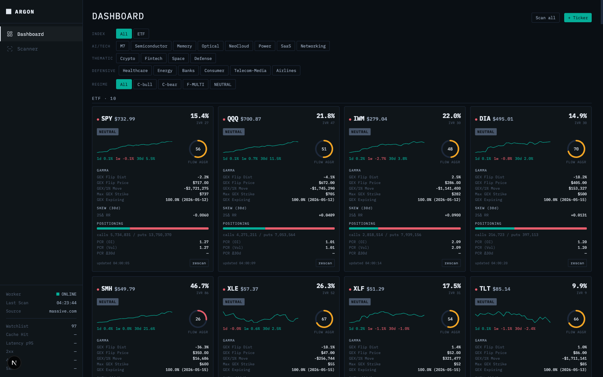
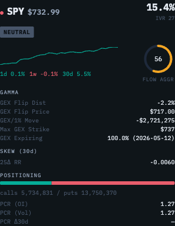
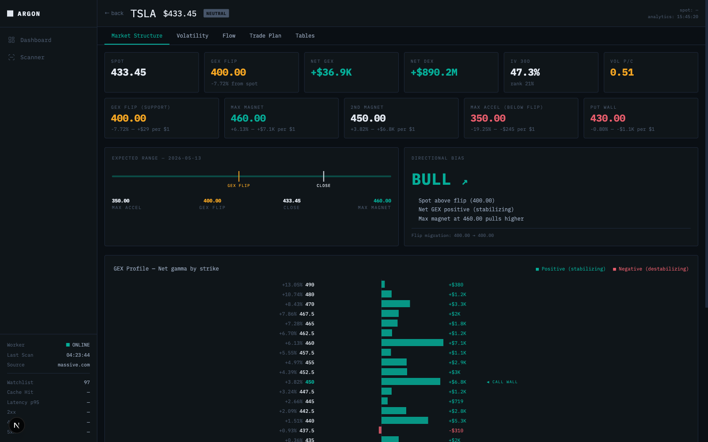
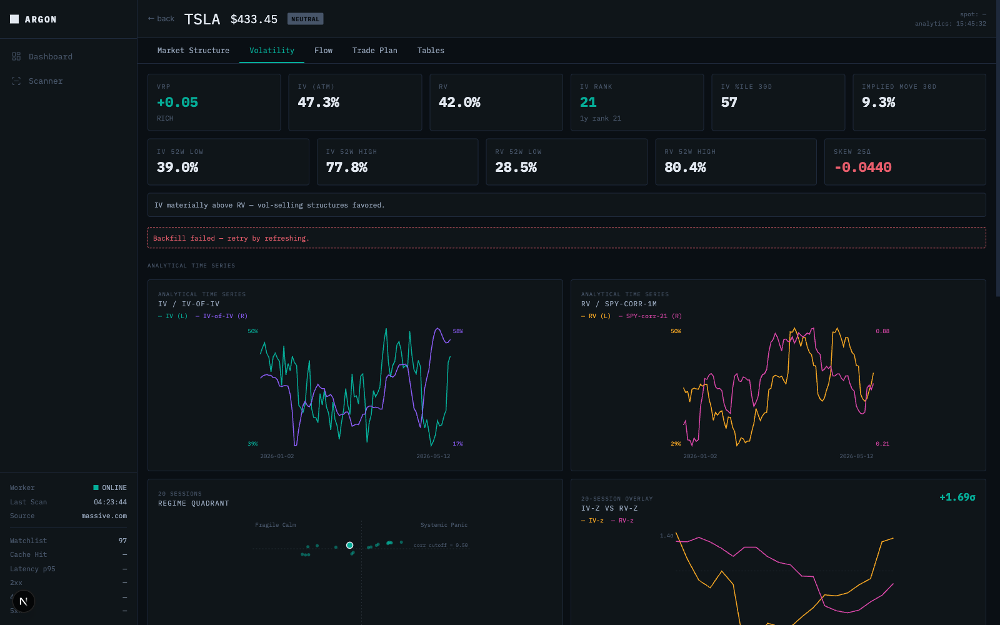

# Unusual Whales Opportunity Scanner

> A per-ticker options research workstation. Pulls dealer gamma, IV surface,
> dark-pool flow, and macro/rates into Postgres — then has two LLMs read the
> same evidence and write a falsifiable, scored 1-2 week swing thesis.



`Python 3.13` · `Next.js 16` · `Postgres` · `uv` · `FastAPI` · `APScheduler`

---

## The problem

Reading raw options flow is a part-time job with full-time stakes. UW prints
land in a firehose. IV surfaces shift intraday. Dealer gamma flips and you
don't notice until price is on the other side of the wall. Macro rates move
and the whole vol complex re-prices. By the time you've stitched five tabs
into one mental picture, the setup has either fired or invalidated.

This is the workstation that does the stitching for you — and then asks two
different LLMs to read the stitched view and commit to a thesis with strikes,
triggers, and an invalidation level. Every thesis is scored against forward
price the next morning, so the system keeps its own report card.

## The system, in one breath

Three layers, one Postgres, one watchlist:

| Layer | What it does | Where it lives |
|---|---|---|
| **Triage** | Card grid across the watchlist — *is this name worth opening today?* | `/` |
| **Diagnosis** | Per-ticker page with dealer gamma, IV surface, flow, regime tabs | `/stock/<TICKER>` |
| **Thesis & score** | Two LLMs commit to a directional trade. The next morning it's graded against forward price. | `/stock/<TICKER>` → AI panel |

Underneath: sharded APScheduler workers pull UW + massive.com + macro/rates
into `option_wizard.uw_scan`; FastAPI serves it read-only; the web layer is
hand-rolled SVG charts because chart libraries always lie about gamma.

---

## A walk through NVDA

### 1. The dashboard catches a name


8:55 AM ET. The grid loads. Most cards look quiet. NVDA's IVR is high, the
flow-aggression dial is pegged, and the setup badge says MOMENTUM. That's
enough to keep reading.

### 2. The card tells you to keep going



GEX flip sits above spot. Net DEX is negative. 25Δ skew has flipped
puts-bid. Put/call OI ratio just crossed 1. A one-glance read says dealers
are positioned for downside and the flow is paying for it. Open the page.

### 3. Market Structure — where dealers want price



Spot below flip. Dealers are short gamma. There's a magnet level, a put
wall below it, and an acceleration zone between the two. If price ticks
into the zone, hedging accelerates the move down. The directional-bias
panel reads the same physics and writes it in English.

### 4. Volatility — is this regime stable?



IV is rich vs realized (the VRP panel shows the spread). IV-of-IV is
climbing, which means the *level* of IV is itself unstable. The regime
quadrant puts today in the high-IV / low-correlation cell — idiosyncratic,
not systematic. That argues for an NVDA-specific structure rather than a
SPY hedge.

### 5. Flow — what's actually printing


Opening prints in the front-week puts inside the last hour, lifting the
ask. That's directional intent, not delta hedging. The flow tab filters
by alert type, premium size, and aggression so you can separate one fund
rolling a hedge from a coordinated push.

### 6. Trade Insights AI — two models read the evidence


This is the climax. Two LLMs — Codex and Claude — each get the same
structured snapshot (dealer regime, IV regime, flow, macro context) and
are asked to commit to a 1-2 week directional thesis.

The v5.3 contract makes the answer falsifiable. Each thesis decomposes into:

- **thesis_trigger** — the level that defines the setup
- **entry_trigger** — the level that arms the trade
- **invalidation** — the level that kills the thesis

Plus an explicit `legs[]` array: strikes, expiries, option types, with
geometric validation (a bear put spread must be 2 puts, long strike >
short strike, same expiry — the model can't hand-wave).

On a recent NVDA setup both models spontaneously converged on
`thesis_trigger=220, entry_trigger=215, invalidation=220`. Codex picked
a 215/210 bear put spread; Claude picked 215/205. The disagreement was
bounded — same thesis, different risk appetite. (Pre-v5.3 the same setup
saw the two models pick different *trigger levels*, which used to be one
overloaded field. Decomposing it into three roles collapsed the
disagreement.)

### 7. The outcome ledger — the report card

```bash
$ curl http://127.0.0.1:8400/api/trade-insights/priors?provider=claude
{
  "rows": [
    {
      "provider": "claude",
      "prompt_version": "trade-insights-ai-v5.3",
      "archetype": "support_breakdown",
      "directional_bias": "SHORT_DELTA",
      "entry_state": "CONDITIONAL",
      "n_rows": 2,
      "resolved_target_hit": 0,
      "resolved_invalidation_hit": 0,
      "resolved_expired": 0,
      "resolved_pending": 2
    },
    ...
  ]
}
```

Every persisted thesis becomes a row in `uw_scan.trade_insight_outcomes`.
At 17:00 ET a nightly worker captures snapshot_close + 1d/3d/5d/10d
forward closes, then checks the three triggers in direction-aware order
(SHORT_DELTA thesis fires when `close < level`, mirrored for LONG_DELTA).
Each row resolves to `target_hit`, `invalidation_hit`, `expired_no_resolution`,
or stays `pending` until the window closes.

The priors view aggregates by `(provider, prompt_version, archetype,
bias, entry_state)` — once enough outcomes accumulate, this is the
substrate for Bayesian-prior reweighting: *"on support_breakdown setups,
Claude is +60bps, Codex is flat — weight Claude more."*

The dashboard for the priors view is intentionally deferred to a
follow-on PR.

---

## More surfaces

The NVDA walkthrough is one path through one ticker. The system covers more:

| Route | What it is | Screenshot |
|---|---|---|
| `/scanner` | Detector-driven candidate list (DCF / Dark Pool / EIC / GEX). Splits into **watchlist candidates** (full detector suite) and **discovered** tickers from the market-wide flow-alerts feed. | `docs/screenshots/scanner.png` |
| `/regime` | Market-wide indicators — CRI (Crash Risk), VCG (Vol-Curve Gauge), SPX GEX with profile chart, vol-backdrop strip. | `docs/screenshots/regime.png` |
| `/gold` | **GOLD COMPASS** — five-tier cockpit on the gold complex. WGC + ETF flow + dealer positioning. Has `/gold/replay/<YYYY-MM-DD>` for historical days. | `docs/screenshots/gold.png` |
| `/rates` | **US Rates Factor Desk** — live FRED Treasury curve, Cleveland Fed 10Y decomposition, policy path, Treasury supply, CFTC TFF positioning, source freshness. | `docs/screenshots/rates.png` |
| `/cockpit/<TICKER>` | Index-only dealer-state view (SPX / SPY / QQQ / IWM). Tabs: state, dealer, surface, flow-IM, VRP. Optional `?asof=YYYY-MM-DD` for historical snapshots. | `docs/screenshots/cockpit.png` |
| `/admin` | Health + scheduler controls. | — |

---

## Under the hood

```
  Unusual Whales API ──┐
  massive.com OHLC ────┤
  FRED / Cleveland Fed ┤
  TreasuryDirect, CFTC ├──→ sharded APScheduler workers
  WGC, LBMA, GPR, ETFs ┤    (uw × 2, massive × 2, ai-codex × 2,
  Fed FOMC, FedWatch ──┘     ai-claude × 2, massive-ws consumer)
                                    │
                                    ▼
                          Postgres  option_wizard.uw_scan
                                    │
                                    ▼
                          FastAPI  read-only  :8400
                                    │
                                    ▼
                          Next.js 16  +  React 19  :3001
```

Eleven dev processes, one database, one schema. Workers are the only
writers; the API is read-only; UI mutations cross through `/api/jobs` and
are drained by the UW workers' 1-second rescan loop. Per-ticker work uses
stable shard ownership and DB claiming (`FOR UPDATE SKIP LOCKED`), so two
workers never duplicate provider calls.

The AI workers sit on the same Postgres but are provider-pinned —
`ai-codex` workers only claim Codex rows, `ai-claude` workers only claim
Claude rows. A child-env allow-list strips upstream credentials before
either runner spawns its CLI: neither worker ever sees UW, massive, or
FRED keys, and the Claude runner specifically blocks `ANTHROPIC_API_KEY`
so the local OAuth keychain (subscription auth) wins instead of an
accidental pay-per-token call.

Eleven processes' worth of data feeds one schema. The schema feeds one
API. The API feeds one UI. Boring is the point.

---

## Run it

**Prereqs:** Postgres, Node 20+, [uv](https://docs.astral.sh/uv/), and
API keys for Unusual Whales, massive.com, and FRED. Optional: Codex CLI
and Claude CLI signed in locally for Trade Insights AI.

```bash
# 1. install
uv sync --extra postgres
cd web && npm install && cd ..

# 2. configure
cp .env.example .env
# Required: UW_SCAN_API_KEY, MASSIVE_API_KEY, FRED_API_KEY,
#           UW_SCAN_DB_*  (host, port, name, user, password)
# Optional: TRADE_INSIGHTS_AI_*, TRADE_INSIGHTS_AI_CLAUDE_*

# 3. migrate (idempotent — safe to re-run)
bash scripts/migrate.sh

# 4. run the full stack
bash scripts/dev.sh
```

Once it's up:

| URL | What it is |
|---|---|
| <http://127.0.0.1:3001> | Web (start at `/`) |
| <http://127.0.0.1:8400/openapi.json> | API contract |
| <http://127.0.0.1:8400/api/health> | Liveness |

**Trade Insights AI auth:** the Claude runner uses your local Claude CLI's
OAuth keychain — the env allow-list strips `ANTHROPIC_API_KEY` so
subscription auth wins. Codex uses your local Codex CLI's signed-in
session. Neither runner sees UW / massive / FRED keys.

**One-shot warmups (optional):**

```bash
uv run python scripts/rates_backfill_once.py --lookback-days 180
uv run python -m uw_scan.worker.gold_warmup
```

---

## Status

Active rework (2026-05-12 → present). The current sprint landed the
directional Trade Insights AI contract (v5.3) and the outcome ledger
([PR #68](https://github.com/moremeds/unusual-whales/pull/68)), plus the
rates dashboard freshness fix
([PR #69](https://github.com/moremeds/unusual-whales/pull/69)).

What's deferred:

- **Priors aggregation UI** — the `/api/trade-insights/priors` endpoint
  ships in PR #68; the dashboard for it is the next follow-on.
- **A handful of gold sources** — CME COMEX intraday and full LBMA history
  are best-effort with documented failure modes; see
  `src/uw_scan/sources/CLAUDE.md`.

Specs, plans, and reviews live under
[`docs/superpowers/`](docs/superpowers/) and
[`docs/reviews/`](docs/reviews/). Per-layer doctrine (uv-only, never
extend `repository.py`, defined-risk only, no Yahoo fallback) lives in
the `CLAUDE.md` files under each subdirectory.

---

Built with `Python 3.13` · `FastAPI` · `Pydantic v2` · `psycopg 3` ·
`APScheduler` · `Next.js 16` · `React 19` · `TypeScript` · `Vitest` ·
`Playwright` · `pytest` · `uv`.
