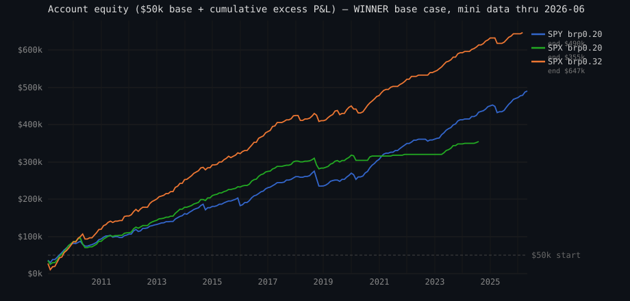

# MASTER REPORT — Macro Short-Vol Capital-Utilisation Study (2026-06-23)

> **Self-contained.** All data is embedded inline (not only in sibling CSVs) so this
> document survives on its own. Every number is `[COMPUTED]` from the reconciled ledger
> (engine Δ Sharpe = 0.000). Nothing here is synthetic or hand-estimated.

---

## 0. Provenance & how to reproduce

| | |
|---|---|
| **Strategy** | Deployed macro short-vol winner (`WINNER` in `src/uw_scan/reports/vrp_macro_signal.py`) |
| **Engine (capital-blind)** | `backtest_laddered(loaded, settings, WINNER, min_date=…)` — the validated ROR backtest (Sharpe ≈1.65) |
| **New layer (dollar account)** | `src/uw_scan/reports/vrp_capital_account.py` — `simulate_account` + `account_metrics` |
| **Sweep runner** | `scripts/research/vrp_capital_sweep.py` |
| **Production data** | mac mini `option_wizard` @ `100.66.147.98`, `uw_scan.vol_index_daily` **through 2026-06-18 (SPX) / 2026-06-19 (VIX)** |
| **Local data** | `option_wizard_local` @ 127.0.0.1 (through 2026-05-21) + equity lake `~/market-warehouse/data-lake` (SPY/QQQ/IWM, through 2026-05-15) |
| **Branch** | `feat/vrp-backtest-r2` |
| **Sibling artifacts** | `capital-sweep-results.csv` (3-name 28-config), `base-case-mini-sweep-2026-06-23.csv` (mini SPX/SPY), `macro-capital-utilisation-verdict.md`, `macro-capital-utilisation-findings.ipynb` |

**Reproduce (3-name $50k sweep, local):**
```bash
UW_SCAN_DB_HOST=127.0.0.1 UW_SCAN_DB_NAME=option_wizard_local \
UW_SCAN_DB_USER=$USER UW_SCAN_API_KEY=x \
uv run python scripts/research/vrp_capital_sweep.py
```
**Reproduce (base case on the mini, freshest data):** point the same script's loaders at
`UW_SCAN_DB_HOST=100.66.147.98 UW_SCAN_DB_NAME=option_wizard UW_SCAN_DB_USER=argon_app`
(password from the main repo `.env.local`; mini host+`option_wizard` is the only combo the
three-tier tripwire allows). Reads are SELECT-only on `vol_index_daily`.

---

## 1. METHODOLOGY

### 1.1 The base case (`WINNER`) — entry / exit rules

```
MacroSignalConfig(
    structure   = 'bull_put_spread',   # defined-risk: sell 0.25Δ put, buy 0.125Δ wing
    short_delta = 0.25,                 # short put delta (OTM magnitude)
    wing_frac   = 0.5,                  # wing_delta = short_delta * wing_frac = 0.125
    hold_days   = 30,                   # 30 TRADING days (~43 calendar, ~40-45 DTE)
    cadence     = 5,                    # weekly entry (every 5 trading days)
    sizing      = 'ramp+',             # size = clamp(vrp_z / ramp_full_z, 0, 1)
    ramp_full_z = 0.5,                  # 0 size at z<=0, full size at z>=0.5
)
```

| Element | Rule |
|---|---|
| **Underlying** | An index (SPX/SPY/QQQ/IWM). Index → no corp actions, no earnings |
| **IV** | Vol-index proxy / 100 (SPX,SPY→VIX; QQQ→VXN; IWM→RVX) |
| **RV** | Realized vol of trailing 20d log-returns, annualised (×√252) |
| **VRP** | IV − RV; **vrp_z** = z-score of VRP over the trailing **252** observations |
| **Entry cadence** | Weekly — a candidate every 5 trading days |
| **Entry gate (ramp+)** | Trade only when **vrp_z > 0** (vol richer than its norm). Position size scales **0→1 linearly as vrp_z goes 0→0.5**; full size above. vrp_z ≤ 0 ⇒ no trade |
| **Strikes** | Flat-vol Black–Scholes invert delta→strike: short put at 0.25Δ, long put (wing) at 0.125Δ |
| **Exit** | Held to expiry at +30 trading days; settled at intrinsic. **No profit-take, no stop** — the long wing is the defined-risk floor |
| **Risk per spread** | max_loss = (put_width − credit) × 100; this is the margin/capital-at-risk per contract |

### 1.2 Two measurement bases (do not conflate)

**(A) Capital-blind return-on-risk (ROR)** — `backtest_laddered`. The canonical "1.65"
basis. A constant-risk *slot* account: each month's book return = size-weighted Σ of the
rung RORs exiting that month, ÷ `max_slots` (=round(hold/cadence)=round(30/5)=6). Every
slot is always funded; **no dollar cap, no idle cash, no integer-contract rounding**. ROR
is scale-invariant (P&L per $1 of max-loss risk), so it measures the *signal's* quality
independent of account size. Monthly-ROR Sharpe is annualised ×√12.

**(B) $50k dollar account** — `simulate_account` (new). Models a real **$50,000 cash
account**:
- Candidate weekly entries across the chosen names share ONE buying-power line.
- Same-date entries rotate priority by date ordinal (no name systematically first).
- Each entry sizes **base** = `floor(w · base_risk_pct · 50000 / margin_per_contract)`
  where `w` = ramp+ weight; optional **overlay** = `floor(overlay_mult · base_risk_pct ·
  50000 / margin)` extra contracts when `vrp_z ≥ rich_threshold` **and base ≥ 1**.
- Capital cap: `actual = min(desired, floor(available / margin))`. Shortfalls logged; a
  rung wanting ≥1 but affording 0 is a **skip**.
- Margin = max_loss × 100 × contracts, held over `[entry, exit)`; freed at expiry.
- Monthly excess P&L (as a fraction of $50k) → metrics. Idle cash earns **rf = 4%**, so
  reported P&L is **excess**; **gross = excess + rf**.

### 1.3 Metrics defined

- **Sharpe** = mean(monthly) / pstdev(monthly) × √12 on the zero-filled contiguous month span.
- **Arithmetic annualised** `ann_return_*` = mean(monthly) × 12 (constant non-compounding
  base). **Geometric** `cagr_*` = (1 + total)^(1/years) − 1. These DIVERGE strongly under
  high variance; the **CAGR is the deployable number**, the arithmetic is a per-month-risk rate.
- **maxDD** = min peak-to-trough of the cumulative **dollar** P&L curve, ÷ $50k. A reading
  past −100% means a loss exceeding starting capital in dollar terms, drawn from a higher
  banked-equity peak.
- **util_mean / util_peak** = mean / max of daily deployed-margin ÷ $50k.
- **skip_rate** = fully-skipped rungs ÷ desired rungs. **fill_rate** = contracts filled ÷
  contracts desired (captures partial fills).
- **win_rate / breach_rate** = fraction of rungs with net P&L > 0 / with the short strike breached.

### 1.4 Correctness — the reconciliation proof

The dollar ledger must not silently diverge from the validated engine. Run SPX-only,
**uncapped** (capital $1e9, base_risk_pct 0.05 → ~30% peak, 0 skips), base-only: the ledger
monthly series is a **constant multiple** (`base_risk_pct × max_slots`) of the engine's
`÷max_slots` series — both P&L and costs scale linearly in contracts, contract count =
`w·budget/margin`, and the constant cancels in mean/stdev. **Sharpe is scale-invariant ⇒
identical up to integer-floor noise.** Verified: **ledger 1.834 = engine 1.834, Δ 0.000**,
0 skips, util_peak 0.300 (`tests/integration/reports/test_vrp_capital_account_db.py`).

### 1.5 Data sources & known data issues

- **vol_index_daily** (VIX 1990→, VXN/RVX 2009-09→, SPX 1975→) — local mirror of the R2
  vol-complex lake. **No Yahoo, ever.**
- **Equity lake** SPY/QQQ/IWM daily closes. **SPY quirk:** SPY's parquet carries ~73%
  null-`trade_date` rows (an alternate-schema partition mixed in); the loader now skips them
  (`d is not None` guard in `_lake_spot`), leaving the clean **8,379-bar daily series
  (1993–2026)**. Validated against known closes: SPY $92.96 on 2009-01-02, $239.85 on
  2020-03-16 (COVID low), $739.17 on 2026-05-15. QQQ/IWM have 0 null dates.
- **Pricing:** flat-vol Black–Scholes (skew ignored). For put spreads this is **conservative**
  — real put-skew credit ≥ modeled, so reported returns are a floor. No real-fill NBBO.

---

## 2. RESULTS

### 2.1 Base case headline — capital-blind, on freshest mini data (through 2026-06-18)

| Window | Sharpe | annROR | maxDD | Calmar | rungs |
|---|---|---|---|---|---|
| **Full 2006-01-03 → 2026-06-18 (incl. 2008)** | **1.652** | 0.530 | −0.796 | 0.67 | 522 |
| 2009-01 → 2026-06-18 (excl. 2008) | 1.834 | 0.566 | −0.590 | 0.96 | 480 |

**1.652 is THE base-case Sharpe** (full history). 1.834 is the post-2008 slice (2008's −80%
tail drags the full-history number down).

### 2.2 Single-name decomposition — capital-blind ROR, 2009+ (why a 3-name blend dilutes)

| Name | IV proxy | Sharpe | annROR | maxDD |
|---|---|---|---|---|
| **SPX** | VIX | **1.834** | 0.566 | −0.59 |
| **SPY** | VIX | **1.460** | 0.450 | −0.81 |
| **QQQ** | VXN | **1.007** | 0.354 | −0.75 |
| **IWM** | RVX | **0.438** | 0.176 | **−1.28** |

SPX→SPY substitution alone costs ~0.37 Sharpe. **IWM is the dilution killer** (0.438 Sharpe,
−128% maxDD; Russell-2000 small-caps have fatter left tails the short-vol spread gets run over by).

### 2.3 $50k SPX direct (cash-settled, European, §1256 — fully tradeable). Mini data.

One SPX spread ≈ **$15,689 margin = 31% of $50k** at SPX 7,446. Min base_risk_pct to fund 1
contract today ≈ **0.31**.

| base_risk_pct | Sharpe | CAGR gross | ann gross | util mean | util peak | skip% | fill% | win% | breach% | rungs | entries/yr |
|---|---|---|---|---|---|---|---|---|---|---|---|
| 0.20 | 1.43 | 0.142 | 0.431 | 0.31 | 1.00 | 0.4% | 98% | 91% | 11% | 279 | 17.9 |
| **0.32** | **1.98** | 0.166 | 0.735 | 0.49 | 1.00 | 14% | 78% | 93% | 9% | 325 | 18.9 |
| 0.50 | 1.87 | 0.177 | 0.904 | 0.61 | 1.00 | 31% | 55% | 93% | 9% | 296 | 17.1 |

⚠ Below base_risk_pct ≈ 0.31, SPX silently can't trade recent (high-index) years; the 1.98
peak is partly a capital-cap quality-filter artifact (binding funds only the richest weeks)
— fragile/in-sample. Robust SPX read = **base_risk_pct 0.20, Sharpe 1.43, 0 skips.**

### 2.4 $50k SPY direct (same signal, 1/10th lump → granular). Mini data.

One SPY spread ≈ **$1,701 = 3.4% of $50k**.

| base_risk_pct | Sharpe | CAGR gross | ann gross | util mean | util peak | skip% | fill% | win% | breach% | rungs | entries/yr |
|---|---|---|---|---|---|---|---|---|---|---|---|
| 0.10 | 1.43 | 0.111 | 0.284 | 0.24 | 0.59 | 0% | 100% | 90% | 12% | 463 | 26.7 |
| **0.20** | **1.56** | 0.147 | 0.548 | 0.49 | 1.00 | 0% | 96% | 90% | 12% | 478 | 27.6 |
| 0.35 | 1.63 | 0.164 | 0.730 | 0.64 | 1.00 | 16% | 71% | 91% | 12% | 410 | 23.7 |
| 0.50 | 1.62 | 0.171 | 0.814 | 0.70 | 1.00 | 26% | 54% | 91% | 11% | 360 | 20.8 |

SPY funds every gate-open week (no silent gaps), Sharpe 1.43–1.63. **The pragmatic $50k vehicle.**

### 2.5 $50k 3-name book (SPY+QQQ+IWM) — full 28-config sweep. Local data, 2009-01-05 → 2026-05-14 (17.33y).

Columns: base_risk_pct | overlay_mult | rich_threshold | ann_gross | cagr_gross | sharpe | maxDD% | util_mean | util_peak | skip% | fill% | rungs.

**Base-only baselines (overlay disabled):**

| brp | ovl | rich | annGro | cagrGro | sharpe | maxDD% | utilM | utilPk | skip% | fill% | rungs |
|---|---|---|---|---|---|---|---|---|---|---|---|
| 0.03 | — | — | 0.152 | 0.082 | 0.86 | −0.40 | 0.17 | 0.50 | 0.00 | 1.00 | 1110 |
| 0.05 | — | — | 0.262 | 0.107 | 0.95 | −0.71 | 0.31 | 0.87 | 0.00 | 1.00 | 1227 |
| 0.08 | — | — | 0.425 | 0.132 | 1.07 | −0.86 | 0.50 | 1.00 | 0.03 | 0.93 | 1237 |
| 0.10 | — | — | 0.474 | 0.139 | 1.06 | −0.84 | 0.57 | 1.00 | 0.08 | 0.84 | 1182 |

**Base + overlay grid (sorted by geometric CAGR gross, desc):**

| brp | ovl | rich | annGro | cagrGro | sharpe | maxDD% | utilM | utilPk | skip% | fill% | rungs |
|---|---|---|---|---|---|---|---|---|---|---|---|
| 0.10 | 2.0 | 0.5 | 0.605 | 0.153 | 1.05 | −1.01 | 0.71 | 1.00 | 0.34 | 0.42 | 848 |
| 0.08 | 2.0 | 0.5 | 0.557 | 0.148 | 1.01 | −1.00 | 0.68 | 1.00 | 0.29 | 0.50 | 902 |
| 0.10 | 1.0 | 0.5 | 0.555 | 0.148 | 1.05 | −0.99 | 0.67 | 1.00 | 0.25 | 0.57 | 967 |
| 0.10 | 2.0 | 1.0 | 0.534 | 0.146 | 1.04 | −0.92 | 0.62 | 1.00 | 0.18 | 0.58 | 1051 |
| 0.10 | 1.0 | 1.5 | 0.512 | 0.143 | 1.13 | −0.84 | 0.59 | 1.00 | 0.11 | 0.79 | 1145 |
| 0.10 | 1.0 | 1.0 | 0.511 | 0.143 | 1.03 | −0.96 | 0.61 | 1.00 | 0.15 | 0.69 | 1094 |
| 0.10 | 2.0 | 1.5 | 0.511 | 0.143 | 1.07 | −0.84 | 0.60 | 1.00 | 0.14 | 0.74 | 1111 |
| 0.08 | 2.0 | 1.0 | 0.510 | 0.143 | 1.07 | −0.93 | 0.58 | 1.00 | 0.14 | 0.67 | 1095 |
| 0.08 | 1.0 | 0.5 | 0.507 | 0.143 | 0.99 | −0.96 | 0.62 | 1.00 | 0.19 | 0.67 | 1036 |
| 0.05 | 2.0 | 0.5 | 0.503 | 0.142 | 1.06 | −0.86 | 0.58 | 1.00 | 0.16 | 0.71 | 1025 |
| 0.08 | 2.0 | 1.5 | 0.480 | 0.139 | 1.15 | −0.86 | 0.54 | 1.00 | 0.07 | 0.85 | 1189 |
| 0.08 | 1.0 | 1.0 | 0.476 | 0.139 | 1.10 | −0.79 | 0.55 | 1.00 | 0.10 | 0.79 | 1150 |
| 0.08 | 1.0 | 1.5 | 0.459 | 0.137 | 1.13 | −0.86 | 0.53 | 1.00 | 0.05 | 0.90 | 1215 |
| 0.05 | 1.0 | 0.5 | 0.433 | 0.134 | 1.12 | −0.83 | 0.49 | 1.00 | 0.05 | 0.89 | 1167 |
| 0.05 | 2.0 | 1.0 | 0.403 | 0.130 | 1.07 | −0.76 | 0.45 | 1.00 | 0.04 | 0.86 | 1172 |
| 0.03 | 2.0 | 0.5 | 0.374 | 0.125 | 1.08 | −0.85 | 0.42 | 1.00 | 0.04 | 0.93 | 1065 |
| 0.05 | 2.0 | 1.5 | 0.340 | 0.120 | 1.18 | −0.69 | 0.37 | 1.00 | 0.01 | 0.98 | 1219 |
| 0.05 | 1.0 | 1.0 | 0.333 | 0.119 | 1.00 | −0.83 | 0.39 | 1.00 | 0.01 | 0.96 | 1214 |
| 0.05 | 1.0 | 1.5 | 0.304 | 0.114 | 1.09 | −0.70 | 0.34 | 0.99 | 0.00 | 1.00 | 1227 |
| 0.03 | 2.0 | 1.0 | 0.241 | 0.103 | 0.89 | −0.64 | 0.28 | 1.00 | 0.00 | 0.98 | 1106 |
| 0.03 | 1.0 | 0.5 | 0.252 | 0.105 | 0.91 | −0.78 | 0.30 | 1.00 | 0.00 | 1.00 | 1110 |
| 0.03 | 2.0 | 1.5 | 0.201 | 0.094 | 1.10 | −0.39 | 0.20 | 0.99 | 0.00 | 1.00 | 1110 |
| 0.03 | 1.0 | 1.0 | 0.192 | 0.092 | 0.89 | −0.50 | 0.22 | 0.86 | 0.00 | 1.00 | 1110 |
| 0.03 | 1.0 | 1.5 | 0.174 | 0.088 | 0.98 | −0.40 | 0.19 | 0.70 | 0.00 | 1.00 | 1110 |

3-name Sharpe ceiling is ~1.0–1.18 — **well below the single-name SPX 1.83** because of the
IWM/QQQ dilution. The overlay lifts raw return but Sharpe stays flat (leverage, not edge).

### 2.6 Entry / exit & trade frequency — realized (SPX, base_risk_pct 0.32, mini)

- **325 rungs / 17.2y**, span 2009-01-02 → 2026-03-02.
- **Hold:** median **43 calendar days** (mean 43.5, range 42–47) = the 30-trading-day hold.
- **Gap between entries:** median **8 days** (consecutive weeks fire), mean **19.2 days** (the
  gate skips cheap-vol weeks).
- **Realized frequency ≈ 19 entries/yr → the weekly slot opens only ~36% of weeks.** The
  ramp+ gate alone opens ~28–32 weeks/yr; capital binding at $50k/0.32 trims to ~19. **In
  practice ~biweekly, clustered in rich-vol regimes — not a weekly trade.**
- **Last 5 SPX rungs** (1 contract, ~$13–16k margin each): net +$3,779 / +$3,056 / +$3,176
  / +$3,165 / +$3,240 — all held clean to expiry, no breach.

### 2.7 Live signal (2026-06-18, mini)

`current_macro_signal(SPX)`: spot **7501**, IV 0.164, **vrp_z −1.95**, weight **0.00**,
**action = SKIP**. Vol cheap → gate shut → stand aside. Live proof the base case is a
rich-vol harvester, not an always-on seller.

### 2.8 Max drawdown — both senses

**Three drawdown conventions (don't confuse them):**
1. **maxDD $ (absolute):** worst peak-to-trough drop of the cumulative dollar P&L curve.
2. **maxDD % of $50k base:** convention #1 ÷ the constant $50,000 starting capital. This is
   what the result tables report. It **can exceed −100%** because the account banks large
   cumulative gains on a *non-compounding* base, so a dollar drawdown can be larger than the
   original $50k while still being a small fraction of the equity peak it fell from.
3. **maxDD % of peak equity:** convention #1 ÷ the highest banked equity before the trough —
   the "how much of your money at the time did you give back" number. This is the small one.

| Config | maxDD $ (abs) | maxDD % of $50k | peak equity $ | maxDD % of peak |
|---|---|---|---|---|
| **SPX direct, brp 0.20** | **−$28,565** | −57.1% | $304,636 | **−9.4%** |
| SPX direct, brp 0.32 | −$39,291 | −78.6% | $596,716 | −6.6% |
| SPX direct, brp 0.50 | −$38,081 | −76.2% | $748,458 | −5.1% |
| **SPY direct, brp 0.20** | **−$40,028** | −80.1% | $440,109 | **−9.1%** |
| SPY direct, brp 0.10 | −$22,672 | −45.3% | $211,100 | −10.7% |
| SPY direct, brp 0.35 | −$42,476 | −85.0% | $598,354 | −7.1% |
| SPY direct, brp 0.50 | −$47,545 | −95.1% | $670,768 | −7.1% |
| 3-name base-only, brp 0.03 | −$20,018 | −40.0% | — | — |
| 3-name base-only, brp 0.10 | −$42,191 | −84.4% | — | — |
| 3-name best-Sharpe (0.05/×2/1.5) | −$34,595 | −69.2% | — | — |
| 3-name max-return (0.10/×2/0.5) | −$50,591 | −101.2% | — | — |

**Reading it:** in absolute dollars the worst peak-to-trough on a $50k account ranges
**−$20k to −$51k** depending on aggressiveness. As a fraction of the $50k base that's −40%
to −101%. But as a fraction of the *equity you actually had at the peak*, every config's
drawdown is only **−5% to −11%** — because the strategy banks $200k–$750k of cumulative P&L
over 17 years before the worst drawdown hits. The −101% headline is a constant-base
accounting artifact, **not** "you lost more than your account": no single drawdown ever
exceeded ~11% of peak equity. The honest risk statement for the recommended **SPY @ brp
0.20** is **≈ −$40k absolute (−80% of the $50k base, −9% of peak equity).**

### 2.9 Equity curve

Account equity = **$50,000 + cumulative monthly excess P&L** (dollars). Near-linear, not
exponential, because sizing is **non-compounding** (each rung risks `base_risk_pct ×` the
*original* $50k, not grown equity). Terminal equity over 2009 → 2026-06 (mini): **SPY brp
0.20 ≈ $490k**, SPX brp 0.20 ≈ $355k, SPX brp 0.32 ≈ $647k.



ASCII fallback (recommended **SPY @ brp 0.20**, 2009 → 2026-06; the flat/down stretches are
the drawdowns quantified in §2.8):

```
$ 490k |                                                                       *
$ 457k |                                                                    *** 
$ 425k |                                                               ******   
$ 392k |                                                            ****        
$ 359k |                                                      ** ***            
$ 327k |                                                   **** *               
$ 294k |                                                ****                    
$ 261k |                                      **    *****                       
$ 229k |                                ***************                         
$ 196k |                           ** ***                                       
$ 163k |                    **********                                          
$ 131k |               ******                                                   
$  98k |        ********                                                        
$  65k |  *********                                                             
$  33k |***                                                                     
$   0k |*                                                                       
      +------------------------------------------------------------------------
       2009                                                            2026
```

Source SVG: `docs/research/vrp/equity-curves-2026-06-23.svg` (hand-rolled, no chart library —
matches repo convention). Reproduce: rerun the equity-curve builder against the mini.

---

## 3. FINDINGS

1. **The base case is real and current:** Sharpe **1.652** capital-blind through 2026-06-18,
   unchanged from the deployed figure.
2. **Tradeable on $50k two ways, both single-name S&P:** SPX direct (Sharpe 1.4–2.0, lumpy
   at ~31%/contract, ~19 entries/yr) or SPY direct (Sharpe 1.43–1.63, granular, ~27/yr, no
   silent gaps).
3. **Do NOT dilute into a 3-name book.** Adding QQQ (1.01) and especially IWM (0.438, −128%
   maxDD) drags the blend to ~1.0 Sharpe. Single-name S&P wins decisively.
4. **base_risk_pct is the only real lever** — it trades CAGR for drawdown and skip-rate.
   util_mean caps ~0.7 because the ramp+ gate forces idle cash in cheap vol (the cost of the edge).
5. **The overlay is leverage, not edge** — lifts raw return strictly in proportion to extra
   risk; Sharpe flat. Only a tight gate (rich_threshold 1.5) nudges risk-adjusted return
   (3-name best Sharpe 1.18 at 0.05/×2/1.5).
6. **Arithmetic ≫ geometric** — best 3-name cell prints 60.5% arithmetic but only 15.3%
   geometric CAGR. The CAGR is the deployable number; the arithmetic is a per-month-risk rate.

**Recommended deployable:** **SPY @ base_risk_pct ≈ 0.20** (Sharpe 1.56, CAGR ~15%, ~0 skips,
util 0.49, ~28 entries/yr) for granularity, or **SPX @ 0.20–0.32** if you accept the lump for
top Sharpe. Gate stays ramp+ (idle when vol cheap — as it is right now). Drop IWM entirely.

---

## 4. CAVEATS & LIMITATIONS

- Flat-vol BS ignores skew → modeled credit is a conservative floor (real fills ≥ modeled);
  no real-fill NBBO. Absolute return is approximate; the *harvest direction* and *relative*
  rankings are faithful.
- $50k ledgers exclude **2008** (min_date 2009-01-01); the capital-blind 1.652 includes it.
  QQQ/IWM sleeves only reach full breadth ~Oct 2010 (VXN/RVX begin 2009-09 + 252d vrp-z warmup).
- SPX margin scales with index level; the "base_risk_pct ≥ 0.31 to trade every year" floor is
  a today-level figure (SPX 7,501).
- SPX/0.32 Sharpe 1.98 is partly a capital-cap quality-filter artifact (in-sample fragile);
  the robust SPX read is base_risk_pct 0.20 → 1.43.
- maxDD past −100% = dollar drawdown exceeding starting capital, drawn from a higher banked
  peak (a real ruin-risk flag for aggressive cells, not an arithmetic glitch).
- T+1 settlement not modeled (margin frees at expiry, same-day reuse) — minor optimism on
  expiry-day entries.
- Same-date entries rotate priority unbiased-on-average; per-name attribution under capital
  binding is noisy by design (read skip_rate / fill_rate).

---

## 5. ARTIFACT INDEX (all committed on `feat/vrp-backtest-r2`)

| File | What |
|---|---|
| `src/uw_scan/reports/vrp_capital_account.py` | The $50k dollar ledger (CapitalConfig, desired_contracts, simulate_account, account_metrics) |
| `src/uw_scan/reports/vrp_macro_drawdown.py` | +SPY in INDEX_SPECS; +`_lake_spot` null-date guard |
| `scripts/research/vrp_capital_sweep.py` | 3-name 28-config sweep runner + reconciliation |
| `docs/research/vrp/capital-sweep-results.csv` | 3-name full trace (28 configs × 23 metrics) |
| `docs/research/vrp/base-case-mini-sweep-2026-06-23.csv` | Mini base-case run: SPX/SPY $50k + capital-blind |
| `docs/research/vrp/macro-capital-utilisation-verdict.md` | 3-name verdict |
| `docs/research/vrp/macro-capital-utilisation-findings.ipynb` | Findings notebook |
| `docs/research/vrp/base-case-mini-run-summary-2026-06-23.md` | Mini run summary |
| `docs/research/vrp/equity-curves-2026-06-23.svg` | Equity curves (SPY/SPX, hand-rolled SVG) |
| `docs/research/vrp/MASTER-macro-short-vol-capital-utilisation-2026-06-23.md` | **This document** |
| `tests/unit/reports/test_vrp_capital_account.py` | 19 unit tests |
| `tests/integration/reports/test_vrp_capital_account_db.py` | 2 DB-gated tests (incl. reconciliation) |
| `docs/research/vrp/macro-short-vol-verdict.md` | Prior PR #150 verdict (the 1.65 winner origin) |
