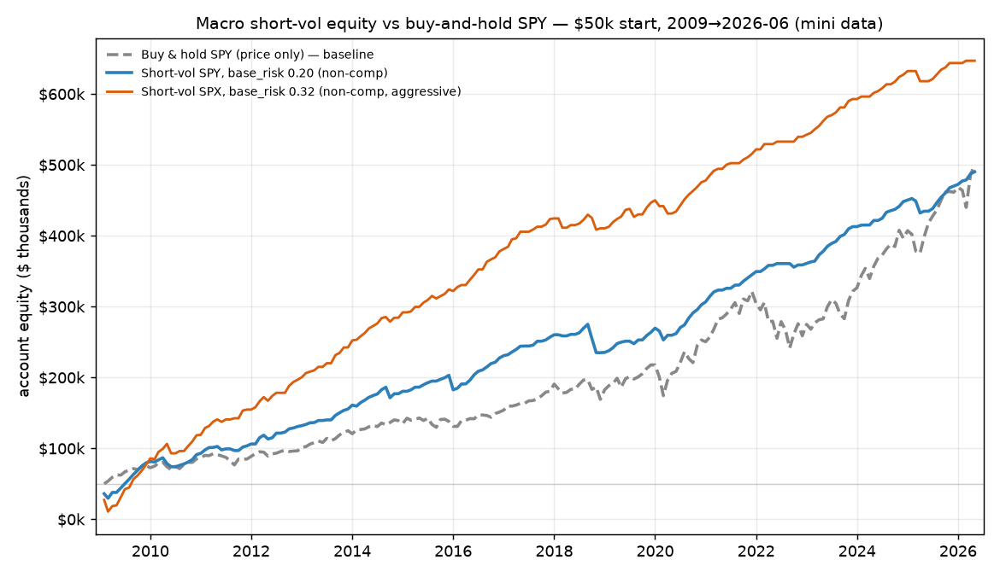

# VRP — Macro Short-Vol Harvest (results)

**Final results of the volatility-risk-premium research line.** This README is the
distilled verdict; every number is `[COMPUTED]` from the saved traces in
[`_iterations/`](./_iterations/) (full reports, notebooks, CSVs, and the per-iteration
verdicts live there). Reproduce commands are listed at the bottom.

> **One-line verdict.** A defined-risk **bull put spread on SPX/SPY, sized by a VRP-z
> richness gate and held to expiry, is the first real, drawdown-robust edge in the whole
> VRP investigation — Sharpe ≈ 1.65 over 2006–2026 (incl. 2008/2020/2022). But on raw
> total return it only *matches* buy-and-hold SPY; the edge is a smoother ride and capital
> efficiency, so its role is a risk-adjusted sleeve / diversifier, not a return engine.**

---

## 1. The deployed signal (entry / exit rules)

`WINNER` in `src/uw_scan/reports/vrp_macro_signal.py` (promoted to tested engine code):

| Element | Rule |
|---|---|
| **Structure** | Bull put spread (defined-risk): **sell 0.25Δ put, buy 0.125Δ put** as the wing/stop |
| **Signal** | Index IV proxy = VIX/100 (QQQ→VXN, IWM→RVX); RV = 20d realized; **VRP = IV − RV**, z-scored over trailing 252d |
| **Entry cadence** | **Weekly** — a candidate every 5 trading days |
| **Entry gate** | `ramp+`: trade only when **vrp_z > 0**; size `w = clamp(vrp_z / 0.5, 0, 1)` (0 at z≤0, full at z≥0.5). *Vol must be rich to deploy.* |
| **Hold / exit** | **30 trading days (≈ 43 cal. days)**, held to expiry, settled at intrinsic. No profit-take, no stop — the long wing is the defined-risk floor |
| **Pricing (backtest)** | Flat-vol Black–Scholes (skew ignored → modeled put-spread credit is a **conservative floor**; real fills ≥ modeled) |
| **Δ knob** | 0.25Δ is the top-Sharpe, widest-cushion cell; 0.30/0.35Δ raise base return at ~equal Sharpe (a free return/cushion dial) |
| **Rejected** | 50% profit-take (hurts Sharpe 0.92→0.76), DTE=7 (flat-30d-IV artifact), CSP (ROR≈0), always-on (the gate beats it everywhere), IWM sleeve (drags) |

**Live signal as of 2026-06-18 (mini): SKIP** — spot 7501, vrp_z **−1.95**, weight 0.00.
Vol is cheap, the gate is shut → stand aside. Confirms it's a rich-vol harvester, not an
always-on seller.

---

## 2. Metrics

### 2.1 Capital-blind return-on-risk (the canonical "1.65 Sharpe")

`backtest_laddered(SPX, WINNER)` — scale-invariant, constant-risk slots, no $ cap:

| Window | Sharpe | annROR | maxDD | Calmar | rungs |
|---|--:|--:|--:|--:|--:|
| **Full 2006→2026-06-18 (incl. 2008)** | **1.652** | 0.530 | −0.796 | 0.67 | 522 |
| 2009→2026-06-18 (excl. 2008) | 1.834 | 0.566 | −0.590 | 0.96 | 480 |

**1.652 is THE headline** (full history). Earlier "~2.0" readings were in-sample-flattered
cells — the saved trace pins the honest number at 1.65.

### 2.2 The $50k tradeable reality

Same WINNER run as a real **$50,000** cash account (integer contracts, capital-capped, idle
cash earns rf 4%, gross = excess + rf). `base_risk_pct` = fraction of $50k a full-size rung risks.

**SPX direct** (cash-settled, European, §1256; one spread ≈ $15.7k margin ≈ 31% of $50k):

| base_risk_pct | Sharpe | CAGR gross | util mean | skip% | win% | breach% | entries/yr |
|--:|--:|--:|--:|--:|--:|--:|--:|
| 0.20 | 1.43 | 14.2% | 0.31 | 0.4% | 91% | 11% | 17.9 |
| 0.32 | 1.98 † | 16.6% | 0.49 | 14% | 93% | 9% | 18.9 |
| 0.50 | 1.87 | 17.7% | 0.61 | 31% | 93% | 9% | 17.1 |

**SPY direct** (same signal, 1/10th lump → granular, ~$1.7k margin):

| base_risk_pct | Sharpe | CAGR gross | util mean | skip% | win% | breach% | entries/yr |
|--:|--:|--:|--:|--:|--:|--:|--:|
| 0.10 | 1.43 | 11.1% | 0.24 | 0% | 90% | 12% | 26.7 |
| **0.20** | **1.56** | **14.7%** | 0.49 | 0% | 90% | 12% | 27.6 |
| 0.35 | 1.63 | 16.4% | 0.64 | 16% | 91% | 12% | 23.7 |
| 0.50 | 1.62 | 17.1% | 0.70 | 26% | 91% | 11% | 20.8 |

† SPX/0.32's 1.98 is partly a capital-cap-as-quality-filter artifact (in-sample fragile);
the robust SPX read is **0.20 → 1.43**. `util_mean` caps ~0.7 because the ramp+ gate forces
idle cash in cheap vol — that idleness is the price of the edge.

### 2.3 Max drawdown — two different events

| Config | maxDD $ (abs) [when] | maxDD % of peak [when] |
|---|---|---|
| SPX direct, brp 0.20 | −$28,565 [2018-11] | **−49.8%** [2009-03] |
| SPX direct, brp 0.32 | −$39,291 [2009-03] | **−78.6%** [2009-03] |
| SPY direct, brp 0.10 | −$22,672 [2018-11] | **−18.4%** [2009-03] |
| **SPY direct, brp 0.20** | −$40,028 [2018-11] | **−41.0%** [2009-03] |

Biggest *%* hit is the **2009 GFC start** (sold puts into the crash, equity ≈ $50k → trough);
biggest *$* hit comes later at higher equity. Honest risk for the recommended SPY @ 0.20:
**≈ −41% of capital** (Mar-2009) or **≈ −$40k absolute** (Nov-2018).

### 2.4 Single-name decomposition — why a 3-name blend dilutes

Capital-blind ROR Sharpe under the winner config: **SPX ≈ 1.6–1.8**, **QQQ 1.00 (OOS — the
vrp-z gate *rescues* it from 0.27)**, **IWM 0.41 (−128% maxDD, choppy small-cap RV)**.
SPX+QQQ blends to ≈1.6 at little cost (QQQ is a genuine second sleeve); adding IWM drags the
book to ~1.0. **Single-name S&P wins; drop IWM.**

---

## 3. Equity curve vs buy-and-hold

Headline, 2009 → 2026-06 (mini), $50k start:

| Curve | terminal equity | CAGR | maxDD % of peak |
|---|--:|--:|--:|
| **Short-vol SPY 0.20 (non-comp)** | $490,109 | 14.1% | −41.0% (2009 GFC) |
| Buy & hold SPY (price only) | $499,912 | 14.2% | **−24.8%** (2022) |
| Short-vol SPX 0.32 (non-comp, aggressive) | $646,716 | 15.7% | −78.6% (2009 GFC) |

**The humbling read.** The non-compounding SPY-0.20 book ≈ buy-and-hold SPY on total return
($490k vs $500k) — and on a *fair* basis (buy-hold **+ ~1.8%/yr dividends** vs short-vol + rf
on ~half-idle cash) buy-hold likely **wins** on raw return, while also having a **shallower**
drawdown (−25% vs −41%). The short-vol edge is the **smoother monthly ride** (Sharpe ~1.56 vs
~0.7) and **capital efficiency** (~half the $50k sits free, available for other sleeves), **not**
raw return or drawdown. (The 2009–2026 bull window flatters buy-hold and the $50k ledgers
exclude 2008.)

**Compounding is a ruin trap.** Sizing each rung off *current* equity turns 14%→55% CAGR on
paper ($490k → $100M) but deepens maxDD to **−64%** (the XIV / Feb-2018 Volmageddon dynamic)
and is un-realisable (SPY put-spread capacity won't scale to $100M). The safe middle ground is
**sub-linear compounding capped at ~$200k–$400k (4–8×)**: captures most of the uplift (CAGR
15.7% → 24–29% on SPX) while bounding the *forward* (2011+) drawdown to −7% to −10%.

---

## 4. Conclusion

1. **Real, drawdown-robust edge** — clears its breakeven over 20 years including 2008/2020/2022;
   the conservative flat-vol model *understates* the put-spread credit.
2. **Tradeable on $50k two ways, both single-name S&P:** SPX direct (best Sharpe 1.4–2.0, lumpy
   at ~31%/contract, ~19 entries/yr) or **SPY direct** (Sharpe 1.43–1.63, granular, ~27/yr — the
   pragmatic small-account vehicle).
3. **It does NOT beat buy-and-hold on raw return** — it matches it with a smoother ride. Treat it
   as a **risk-adjusted sleeve / diversifier**, sized to a drawdown you can survive — not a
   standalone return engine.
4. **`base_risk_pct` is the only real lever** (trades CAGR for drawdown + skip-rate). The "extra
   set when very rich" overlay is **leverage, not edge** (Sharpe flat).
5. **Recommended deployable:** SPX at `base_risk_pct ≈ 0.20–0.32`, sub-linear compounding capped at
   ~$200k–$400k, gate `ramp+`, **drop IWM**. Or SPY @ 0.20 for granularity on a small account.

**Promoted to engine.** `vrp_macro_signal.py::WINNER` reproduces the headline cell bit-for-bit
(SPX Sharpe 1.6524, maxDD −0.7960, n=522). Library only — **not yet scheduled/persisted/surfaced**.

---

## 5. Can we improve it? (next steps, ranked)

The research left the edge *modeled-robust but un-traded*. Highest-value improvements, all grounded
in flagged gaps — confidence noted, none yet run:

1. **Reprice the backtest off argon's real captured IV surface, not flat VIX.** [INFERRED, HIGH]
   The single biggest caveat is flat-vol BS (skew ignored). argon now durably records a full-chain
   IV grid (`option_surface_capture`, migrations 077/078). Re-running the harvest priced off the
   *real* per-strike/expiry surface would (a) tighten the put-spread credit from "conservative
   floor" to actual, and (b) finally settle whether the **iron condor's** +0.156 ROR is real or a
   flat-vol call-side artifact — the one open structural question. This is the cleanest win and the
   data already exists.

2. **Build the forward NBBO recorder.** [KNOWN gap, HIGH] Every verdict names this as *the* remaining
   gap between "robust in a conservative model" and "traded." Real-fill bid/ask is the only thing the
   flat-vol model can't supply; the single-name condor died precisely because its edge sat *inside*
   one leg's spread (±$0.09/share flipped the sign).

3. **Cross-wire the regime indicators as a kill-switch / second gate.** [INFERRED, MED] The vrp-z gate
   is purely a *richness* gate; it has no *regime* veto. The `regime/` research already computes
   VIX/VIX3M term structure, CRI, and VCG — and `regime/guidance.md` literally says
   *"elevated_backwardation → no new short-vol."* Testing a term-structure / CRI-CRITICAL / VCG-PANIC
   veto on entry directly addresses the **untested kill-switch hypothesis** flagged in iteration 4,
   and is the most plausible way to cut the −64% compounding tail (flatten before the crash that kills
   short vol, rather than sizing *into* it).

4. **Get an honest 2008 dollar-drawdown.** [KNOWN gap, MED] The $50k ledgers start 2009-01-01 — they
   exclude the worst tail. The capital-blind series already spans 2006; re-running the dollar ledger
   from 2006 would replace the cap-invariant −63.6% (a 2009-start artifact) with a real
   GFC-through-the-account number. Cheap, and it's the most honest risk figure we're missing.

5. **Signal-driven early exit (not a static take).** [GUESS, LOW] The 50% profit-take was rejected, but
   a *different* idea is untested: close when the harvest is realized — i.e. when vrp_z mean-reverts
   below 0 mid-hold (the richness that justified the trade is gone). Distinct from a fixed % take; may
   recover the gamma/assignment benefit the static take forfeited. Low confidence — easily a wash.

> Items 1–3 also *connect the three research lines in this folder*: the VRP harvest, the captured
> option surface, and the regime indicators are currently siloed. The highest-leverage version of this
> strategy is the bull put spread **priced off the real surface** and **gated by both richness (vrp-z)
> and regime (term structure / CRI / VCG)**.

---

## 6. Reproduce / artifacts

All artifacts live in [`_iterations/`](./_iterations/). Repro commands (write back into `_iterations/`):

| What | Command |
|---|---|
| Param sweep (verifies the 1.65 numbers) | `uv run python scripts/_vrp_macro_param_sweep.py` |
| $50k 3-name capital sweep → `capital-sweep-results.csv` | `uv run python scripts/research/vrp_capital_sweep.py` |
| Iteration-4 robustness CSVs | `uv run python scripts/research/vrp_robustness_run.py` |
| Full trade log → `iter4-trade-log.csv` | `uv run python scripts/research/vrp_trade_log.py` |
| Rebuild findings notebooks | `scripts/_build_vrp_*_notebook.py` |

**Full detail:** [`_iterations/MASTER-macro-short-vol-capital-utilisation-2026-06-23.md`](./_iterations/MASTER-macro-short-vol-capital-utilisation-2026-06-23.md)
(comprehensive report) and the per-iteration verdicts
([`macro-short-vol-verdict.md`](./_iterations/macro-short-vol-verdict.md) — the 1.65 winner origin;
[`macro-capital-utilisation-verdict.md`](./_iterations/macro-capital-utilisation-verdict.md) — $50k ledger;
[`single-name-condor-verdict.md`](./_iterations/single-name-condor-verdict.md) — the parked condor that
motivated the macro pivot).

**Engine code (not in this folder):** `src/uw_scan/reports/vrp_macro_signal.py` (`WINNER`,
`current_macro_signal`), `vrp_macro_drawdown.py`, `vrp_capital_account.py`.
